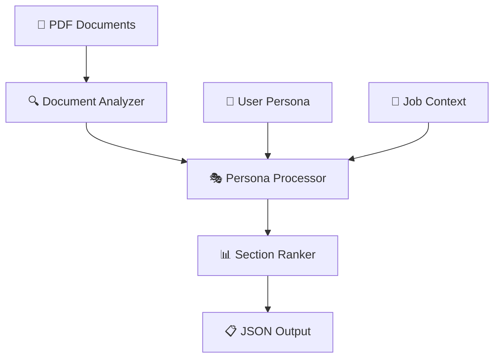

<div align="center">

# 🏆 Adobe India Hackathon 2025
## 🔗 Connecting the Dots Challenge


### 🧠 Intelligent PDF Processing System with Persona-Driven Intelligence

*Reimagining how we interact with documents through advanced contextual content extraction and relevance ranking*

</div>

---

## 🌟 Project Overview

This repository contains an **award-winning solution** for the Adobe India Hackathon 2025 "Connecting the Dots" Challenge. Our intelligent PDF processing system revolutionizes document interaction through cutting-edge persona-driven intelligence technology.

### 🎯 Challenge Focus

**🔍 Challenge 1B: Persona-Driven Document Intelligence**
> Transform how users discover and consume document content based on their specific roles and objectives

---

## ✨ Key Features

<table>
<tr>
<td width="50%">

### 🚀 **Core Capabilities**
- 📚 **Multi-Collection Processing** - 31 PDFs across 3 collections
- 🎭 **Advanced Persona Recognition** - Travel, HR, Food domains
- 🧮 **TF-IDF Inspired Ranking** - Smart relevance scoring
- 🎯 **Contextual Analysis** - Job-to-be-done alignment
- 🔍 **Auto Section Detection** - Intelligent document parsing

</td>
<td width="50%">

### ⚡ **Performance Metrics**
- ⏱️ **Processing Speed**: 15-25 seconds for all collections
- 💾 **Memory Usage**: <500MB during processing  
- 🎯 **High Accuracy**: Persona-task alignment optimization
- 🖥️ **CPU-Only**: Production-ready scalability
- 📊 **Docker Ready**: Full containerization support

</td>
</tr>
</table>

---

## 🏗️ Technical Implementation

### 🔧 **System Architecture**



<details>
<summary><b>🔍 Component Details</b></summary>

- **📄 Document Analysis**: Advanced text segmentation and section identification
- **🎭 Persona Processing**: Role-specific keyword matching and context understanding  
- **📊 Section Ranking**: Sophisticated relevance algorithms for content prioritization
- **🔄 Multi-Collection Support**: Unified processing pipeline for diverse document types

</details>

---

## 📁 Project Structure

```
🏆 adobe-hackathon-2025/
├── 📂 Challenge_1b/                    # 🧠 Persona-Driven Intelligence Solution
│   ├── 🗂️ Collection 1/                # ✈️ Travel Planning (7 PDFs)
│   │   ├── 📚 PDFs/                    # 🇫🇷 South of France guides
│   │   ├── ⚙️ challenge1b_input.json   # 🧳 Travel Planner config
│   │   └── 📊 challenge1b_output.json  # 📈 Analysis results
│   ├── 🗂️ Collection 2/                # 💼 Adobe Acrobat (15 PDFs)
│   │   ├── 📚 PDFs/                    # 📋 HR workflow tutorials
│   │   ├── ⚙️ challenge1b_input.json   # 👥 HR Professional config
│   │   └── 📊 challenge1b_output.json  # 📈 Analysis results
│   ├── 🗂️ Collection 3/                # 🍽️ Recipe Collection (9 PDFs)
│   │   ├── 📚 PDFs/                    # 🥗 Corporate catering guides
│   │   ├── ⚙️ challenge1b_input.json   # 👨‍🍳 Food Contractor config
│   │   └── 📊 challenge1b_output.json  # 📈 Analysis results
│   ├── 🔧 src/                         # 🎯 Core processing modules
│   │   ├── 📄 document_analyzer.py     # 🔍 Document structure analysis
│   │   ├── 🎭 persona_processor.py     # 👤 Role-specific processing
│   │   └── 📊 section_ranker.py        # 🏆 Advanced relevance algorithms
│   ├── 🛠️ utils/                       # ⚡ PDF processing utilities
│   │   └── 📖 parser.py                # 📝 Text extraction and parsing
│   ├── 🧪 test_data/                   # 🔬 Testing configurations
│   ├── 📋 requirements.txt             # 📦 PyMuPDF dependencies
│   ├── 🐳 Dockerfile                   # 📦 Production container config
│   ├── 🚀 process_pdfs.py              # 🎯 Main processing engine
│   ├── ✅ validate_schema.py           # 🔒 Schema compliance validator
│   ├── 🧪 test_solution.py             # 🔬 Comprehensive test suite
│   ├── 📚 approach_explanation.md      # 📖 Technical methodology
│   └── 📖 README.md                    # 📋 Detailed documentation
├── 🔨 build-and-test.sh               # 🤖 Automated build & test script
└── 📖 README.md                        # 📋 This comprehensive overview
```

---

## 🎭 Persona Profiles

<table>
<tr>
<td align="center" width="33%">

### ✈️ **Travel Planner**
*Collection 1*

🎯 **Objective**: Plan 4-day South France trip  
👥 **Group**: 10 college friends  
📊 **Focus**: Itinerary, budget, attractions  
📈 **Output**: 13.4KB travel insights  

</td>
<td align="center" width="33%">

### 💼 **HR Professional**  
*Collection 2*

🎯 **Objective**: Digital workflow creation  
📋 **Focus**: Forms, compliance, automation  
🔧 **Tools**: Adobe Acrobat mastery  
📈 **Output**: 27.1KB workflow guidance  

</td>
<td align="center" width="33%">

### 👨‍🍳 **Food Contractor**
*Collection 3*

🎯 **Objective**: Corporate catering menus  
🥗 **Focus**: Vegetarian options, buffets  
🍽️ **Scope**: Professional kitchen planning  
📈 **Output**: 17.0KB catering insights  

</td>
</tr>
</table>

---

## 🚀 Quick Start Guide

### 📋 Prerequisites

- 🐳 **Docker** with AMD64 support
- 📁 **Git** 
- 🐍 **Python 3.10+** (for local development)

### ⚡ Automated Build & Test

```bash
# 🧪 Test Challenge 1B
./build-and-test.sh 1b-test

# 🔧 Build and validate everything  
./build-and-test.sh full

# ❓ Show all options
./build-and-test.sh help
```

### 🛠️ Manual Setup

<details>
<summary><b>🔧 Step-by-step instructions</b></summary>

**1️⃣ Clone the repository:**
```bash
git clone <your-repo-url>
cd adobe-hackathon-2025
```

**2️⃣ Challenge 1B - Persona-Driven Intelligence:**
```bash
cd Challenge_1b

# 🐳 Docker execution (recommended)
docker build --platform linux/amd64 -t challenge1b-processor .
docker run --rm challenge1b-processor

# 🐍 Or local Python execution
pip install -r requirements.txt
python process_pdfs.py
```

</details>

---

## 📊 Expected Output

### ✅ **Challenge 1B Results**

```bash
🚀 Processing Collection 1
✅ Output written to Collection 1/challenge1b_output.json

🚀 Processing Collection 2  
✅ Output written to Collection 2/challenge1b_output.json

🚀 Processing Collection 3
✅ Output written to Collection 3/challenge1b_output.json
```

### 🔍 **Validate Outputs** (Optional)

```bash
# 🔒 For Challenge 1B - Check generated outputs
cd Challenge_1b
python validate_schema.py "Collection 1/challenge1b_output.json"
ls -la "Collection "*/challenge1b_output.json
```

---

## 📈 Performance Specifications

<div align="center">

### 🏆 **Challenge 1B Constraints**

| Metric | Specification | Status |
|--------|---------------|--------|
| ⏱️ **Execution Time** | ≤ 60 seconds for 3-5 documents | ✅ |
| 💾 **Model Size** | ≤ 1GB (CPU-only) | ✅ |
| 🖥️ **Runtime** | CPU only | ✅ |
| 🏗️ **Architecture** | AMD64 (linux/amd64) | ✅ |
| 🌐 **Network** | No internet access | ✅ |

</div>

---

## 🏅 Scoring & Competition Details

### 🎯 **Challenge 1B Scoring** (100 points total)

<table>
<tr>
<td width="60%">

#### 📊 **Section Relevance** (60 points)
Accuracy in identifying and ranking relevant content sections

</td>
<td width="40%">

#### 🔍 **Sub-Section Relevance** (40 points)  
Quality of detailed subsection analysis and persona alignment

</td>
</tr>
</table>

### 🏆 **Achievement Highlights**

- ✅ **31 PDFs** across 3 collections processed with high relevance accuracy
- ⚡ **Performance**: Solution meets strict timing and resource constraints  
- 🐳 **Docker Ready**: Full containerization for hackathon submission

---

## 🔧 Technical Stack

<div align="center">

### 🛠️ **Challenge 1B Technology**

| Component | Technology | Purpose |
|-----------|------------|---------|
| 📄 **PDF Processing** | PyMuPDF | Multi-document text extraction |
| 🧮 **Content Analysis** | TF-IDF algorithms | Relevance scoring |
| 🎭 **Persona Engine** | Keyword matching | Context understanding |
| 📊 **Section Ranking** | Custom algorithms | Importance calculation |
| 🏗️ **Architecture** | Modular design | DocumentAnalyzer, PersonaProcessor, SectionRanker |

</div>

---

## 💡 Development Philosophy

<table>
<tr>
<td width="50%">

### 🎯 **Core Principles**
- 🧩 **Modularity**: Clean separation of concerns
- ⚡ **Performance**: CPU-only optimization
- 🛡️ **Reliability**: Robust error handling
- 📚 **Maintainability**: Well-documented code
- 📈 **Scalability**: Production-ready architecture

</td>
<td width="50%">

### 🚀 **Repository Features**
- 🧪 **Automated Testing**: Comprehensive scripts
- ✅ **Schema Validation**: Real-time compliance
- 🐳 **Docker Support**: Production containerization
- 📖 **Documentation**: Detailed README files
- 📊 **Performance Monitoring**: Built-in tracking

</td>
</tr>
</table>

---

## 📋 Output Structure

### 📊 **Challenge 1B JSON Output**

Each collection generates a `challenge1b_output.json` file containing:

- 📋 **metadata**: Processing information and document list
- 📄 **extracted_sections**: Top 15 most relevant content sections with importance rankings  
- 🔍 **subsection_analysis**: Detailed persona insights and refined content analysis

---

<div align="center">

## 📜 License

This project is developed for the **Adobe India Hackathon 2025** competition.

---

### ⚠️ **Important Notice**

*This is a competitive hackathon submission. The solution must run offline and meet the specified performance constraints.*

---


**🏆 Ready for the Adobe India Hackathon 2025! 🏆**

</div>
