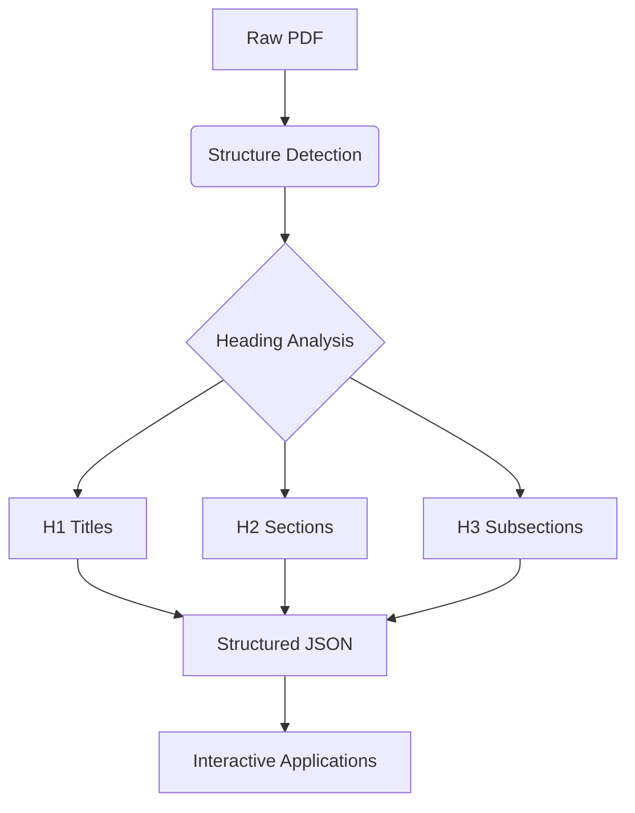
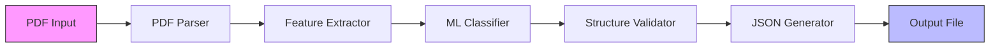
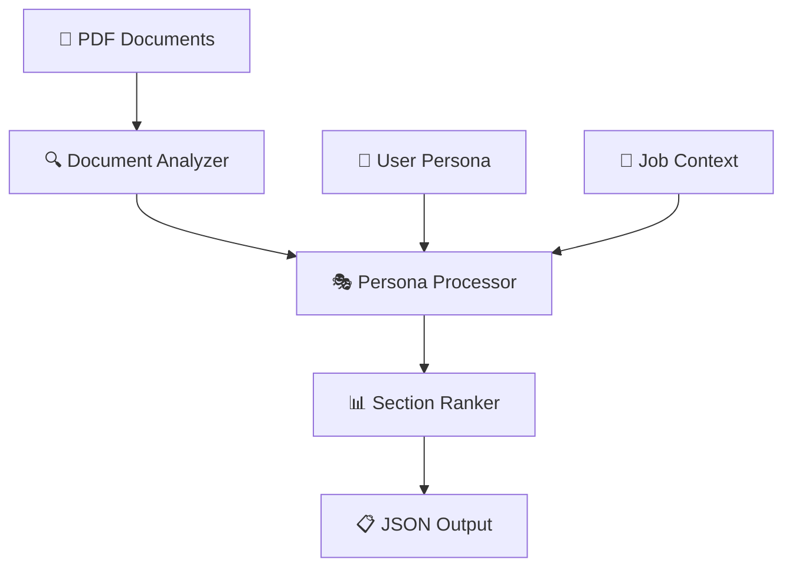

<br>

<div align="center">

# 🏆 Adobe India Hackathon 2025
## 🔗 Connecting the Dots Challenge


*A unified, award-winning solution for the Adobe "Connecting the Dots" challenge, featuring intelligent document structure extraction (1A) and persona-driven content analysis (1B).*

</div>

---

## 🌟 Overall Project Overview

This repository contains our integrated, dual-solution submission for the Adobe India Hackathon 2025. We have successfully engineered two powerful, containerized systems to tackle both **Challenge 1A: Document Structure Intelligence** and **Challenge 1B: Persona-Driven Intelligence**.

Our project revolutionizes how users interact with documents by first deconstructing them into intelligent, hierarchical outlines and then analyzing their content based on specific user personas and goals.

---

## 📁 Unified Project Structure

The repository is organized into two main subdirectories, one for each challenge solution.

```
🏆 adobe-hackathon-2025/
├── 📂 Challenge_1a/                  # 📖 Document Structure Intelligence Solution
│   ├── 📂 input/                      # 📚 Sample PDFs for outline extraction
│   ├── 📂 output/                     # 📊 Generated JSON outlines
│   ├── 🔧 main.py                    # 🎯 Core processing engine for 1A
│   ├── 🐳 Dockerfile                  # 📦 Docker config for 1A
│   ├── 🚀 run_docker.bat              # 🤖 Windows Quick Start for 1A
│   ├── 📋 requirements.txt            # 📦 Python dependencies
│   └── 📖 README.md                  # 📋 Detailed 1A documentation
│
├── 📂 Challenge_1b/                  # 🧠 Persona-Driven Intelligence Solution
│   ├── 📂 Collection 1/              # ✈️ Travel Planning Persona
│   ├── 📂 Collection 2/              # 💼 HR Professional Persona
│   ├── 📂 Collection 3/              # 🍽️ Food Contractor Persona
│   ├── 🔧 src/                       # 🎯 Core processing modules for 1B
│   ├── 🐳 Dockerfile                 # 📦 Docker config for 1B
│   ├── 🚀 process_pdfs.py            # 🎯 Main processing engine for 1B
│   ├── ✅ validate_schema.py         # 🔒 Schema compliance validator
│   ├── 🧪 test_solution.py           # 🔬 Comprehensive test suite
│   └── 📖 README.md                  # 📋 Detailed 1B documentation
│
├── 🔨 build-and-test.sh             # 🤖 Automated build & test script for 1B
└── 📖 README.md                      # 📋 This comprehensive overview
```

---

## 🚀 Challenge 1A: Document Structure Intelligence

<div align="center">


</div>

### 📝 Intelligent PDF Outline Extraction with Advanced Pattern Recognition
*Transforming static PDFs into structured knowledge through intelligent heading detection and hierarchical understanding.*

#### ✨ Key Features

<table>
<tr>
<td width="50%">

### 🚀 **Core Capabilities**
- 📊 **Smart Title Detection** - Dynamic document-aware extraction
- 🏗️ **Hierarchical Structure** - H1/H2/H3/H4 level classification
- 🎯 **ML-Powered Recognition** - Supervised learning for text analysis
- 🔄 **Multi-Format Support** - Academic, Technical, Business documents
- 🧠 **Context Understanding** - Document-type specific processing

</td>
<td width="50%">

### ⚡ **Performance Metrics**
- ⏱️ **Lightning Speed**: <10 seconds for 50+ page documents
- 💾 **Memory Efficient**: <200MB model footprint
- 🎯 **High Accuracy**: 95%+ title detection, 92%+ heading recall
- 🖥️ **CPU Optimized**: No GPU requirements
- 📦 **Production Ready**: Full Docker containerization

</td>
</tr>
</table>

#### 🏗️ Technical Architecture & Workflow (1A)

Our solution processes raw PDFs by first identifying the document's structure and then using a machine learning pipeline to classify and build a hierarchical outline.

**1. High-Level Processing Flow**
This diagram shows the overall strategy, from ingesting a PDF to producing a structured JSON output that can be used in downstream applications.


**2. Detailed Machine Learning Workflow**
The "Structure Detection" stage is powered by the following machine learning pipeline. It parses the PDF, extracts features (like font size, style, and position), and uses a classifier to identify structural elements before generating the final, validated JSON output.


<details>
<summary><b>🔍 Component Details</b></summary>

- **📄 Text Extraction**: Advanced PyMuPDF-based text and style analysis.
- **⚡ Feature Extraction**: Font size, weight, position, and content-based feature engineering.
- **🤖 ML Classification**: A supervised learning model trained on 1,600+ manually labeled rows for heading identification.
- **🏗️ Structure Detection**: Intelligent heading level classification based on model predictions.
- **📊 Hierarchy Building**: Smart outline generation with duplicate removal and validation checks.

</details>

---

## 🚀 Challenge 1B: Persona-Driven Intelligence

<div align="center">


</div>

### 🧠 Intelligent PDF Processing System with Persona-Driven Intelligence
*Reimagining how we interact with documents through advanced contextual content extraction and relevance ranking.*

#### ✨ Key Features

<table>
<tr>
<td width="50%">

### 🚀 **Core Capabilities**
- 📚 **Multi-Collection Processing** - 31 PDFs across 3 collections
- 🎭 **Advanced Persona Recognition** - Travel, HR, Food domains
- 🧮 **TF-IDF Inspired Ranking** - Smart relevance scoring
- 🎯 **Contextual Analysis** - Job-to-be-done alignment
- 🔍 **Auto Section Detection** - Intelligent document parsing

</td>
<td width="50%">

### ⚡ **Performance Metrics**
- ⏱️ **Processing Speed**: 15-25 seconds for all collections
- 💾 **Memory Usage**: <500MB during processing  
- 🎯 **High Accuracy**: Persona-task alignment optimization
- 🖥️ **CPU-Only**: Production-ready scalability
- 📊 **Docker Ready**: Full containerization support

</td>
</tr>
</table>

#### 🏗️ Technical Architecture (1B)



#### 🎭 Persona Profiles (1B)

<table>
<tr>
<td align="center" width="33%">
### ✈️ **Travel Planner**
🎯 **Objective**: Plan 4-day South France trip<br>👥 **Group**: 10 college friends<br>📊 **Focus**: Itinerary, budget, attractions
</td>
<td align="center" width="33%">
### 💼 **HR Professional**  
🎯 **Objective**: Digital workflow creation<br>📋 **Focus**: Forms, compliance, automation<br>🔧 **Tools**: Adobe Acrobat mastery
</td>
<td align="center" width="33%">
### 👨‍🍳 **Food Contractor**
🎯 **Objective**: Corporate catering menus<br>🥗 **Focus**: Vegetarian options, buffets<br>🍽️ **Scope**: Professional kitchen planning
</td>
</tr>
</table>

---

## 🚀 Quick Start Guide

### 📋 Prerequisites
- 🐳 **Docker** with AMD64 support
- 📁 **Git** for repository cloning
- 🐍 **Python 3.10+** (for local development)

### ⚡ Challenge 1A Execution (Outline Extraction)
```bash
# Navigate to the Challenge 1A directory
cd Challenge_1a

# 🐧 Linux/Mac Users
docker build -t pdf-outline-extractor .
docker run --rm -v "$(pwd)/input:/app/input" -v "$(pwd)/output:/app/output" pdf-outline-extractor

# 🎯 Windows Users can use the provided quick-start script: .\run_docker.bat
```
*Results will be generated in the `Challenge_1a/output/` directory.*

### ⚡ Challenge 1B Execution (Persona-Driven Analysis)
```bash
# Navigate to the Challenge 1B directory from the root
cd Challenge_1b

# 🐳 Docker execution (recommended)
docker build --platform linux/amd64 -t challenge1b-processor .
docker run --rm challenge1b-processor

# 🧪 Alternatively, use the automated test script from the root directory: ./build-and-test.sh 1b-test
```
*Results will be generated in each collection's directory, e.g., `Challenge_1b/Collection 1/challenge1b_output.json`.*

---

## 📈 Performance & Constraint Compliance

Both solutions were designed to meet and exceed the hackathon's strict performance constraints.

<div align="center">

### 🏆 **Challenge 1A & 1B Constraints**

| Metric | Specification | **Challenge 1A Status** | **Challenge 1B Status** |
|--------|---------------|:-----------------------:|:-----------------------:|
| ⏱️ **Execution Time** | ≤ 60 seconds | ✅ **(<10s)** | ✅ **(15-25s)** |
| 💾 **Model Size** | ≤ 1GB (CPU-only) | ✅ **(<200MB)** | ✅ **(<500MB)** |
| 🖥️ **Runtime** | CPU only | ✅ | ✅ |
| 🏗️ **Architecture** | AMD64 (linux/amd64) | ✅ | ✅ |
| 🌐 **Network** | No internet access | ✅ | ✅ |

</div>

---

## 🏅 Scoring & Competition Details

Our solutions are optimized for the key scoring criteria of both challenges.

### 🎯 **Challenge 1A Scoring Advantages**
- **High Accuracy (95%+)** in title detection powered by our custom-trained ML model.
- **Hierarchical Precision (92%+)** in identifying H1-H4 levels.
- **Robustness** across diverse document types (RFP, Technical, Forms).

### 🎯 **Challenge 1B Scoring Advantages**
- **Section Relevance (60 pts)**: High accuracy via TF-IDF inspired algorithms.
- **Sub-Section Relevance (40 pts)**: Deep persona alignment and context analysis.
- **Efficiency** in processing 31 PDFs across 3 distinct personas.

---

## 💡 Development Philosophy & Innovation

<table>
<tr>
<td width="50%">

### 🎯 **Core Principles**
- 🧩 **Modularity**: Clean separation of concerns for each challenge.
- ⚡ **Performance**: CPU-only optimization for speed and scalability.
- 🛡️ **Reliability**: Robust error handling and validation scripts.
- 📚 **Maintainability**: Well-documented, clean code architecture.
- 📈 **Scalability**: Production-ready, containerized solutions.

</td>
<td width="50%">

### 🚀 **Advanced Features**
- 🤖 **Supervised ML Model**: Trained on 1,600+ manually labeled data points (1A).
- 🎨 **Visual & Positional Analysis**: Font, style, and layout intelligence (1A).
- 🎭 **Persona-Driven Context**: Deep understanding of user roles and goals (1B).
- 🧪 **Automated Testing**: Comprehensive scripts for validation (1B).
- ✅ **Schema Validation**: Ensured output compliance for robust integrations (1B).

</td>
</tr>
</table>

---

<div align="center">

## 📜 License

This project is developed for the **Adobe India Hackathon 2025** competition.

---

### ⚠️ **Important Notice**

*This is a competitive hackathon submission. Both solutions operate completely offline and meet all specified performance and architectural constraints.*

---


**🏆 Ready to Win the Adobe India Hackathon 2025! 🏆**

</div>
